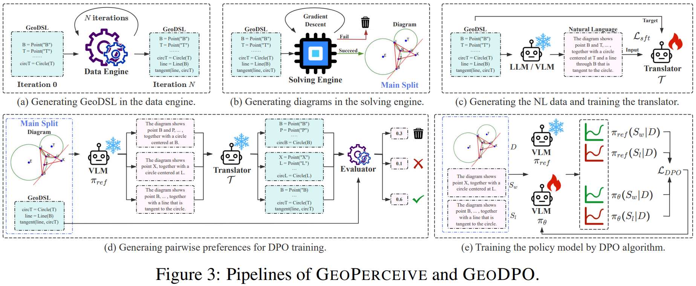
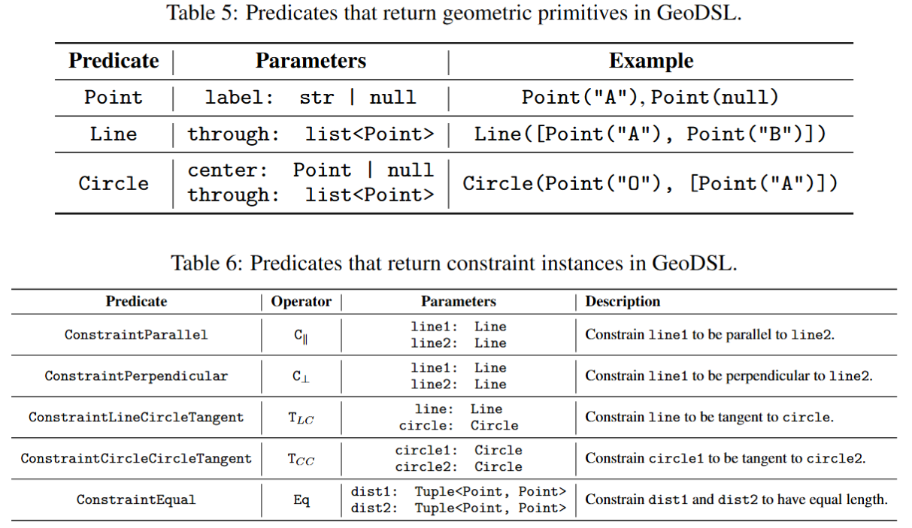
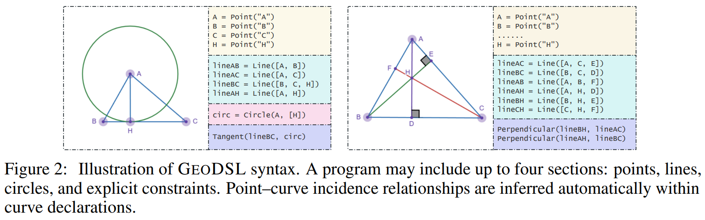

# GeoPerceive

Vision-language models often struggle with geometric reasoning due to poor perception of basic diagram elements. To address this issue, we introduce **GeoPerceive**, an automatically generated benchmark with data and solving engines that isolates and assesses geometric grounding, alongside **GeoDSL**, a canonical domain-specific language that eliminates construction ambiguity and succinctly represents planar diagrams. We then train an NL-to-DSL translator on synthetic natural language and DSL pairs, leveraging its soft confidence scores for both robust automatic evaluation and as reward signals in a downstream reinforcement learning stage. Our **GeoDPO** framework applies Direct Preference Optimization to align vision-language model outputs with human interpretable geometric preferences, yielding a 14.2% increase in overall perception score over a strong baseline. 

## 1. GeoDSL

In this section, we introduce **GeoDSL**, a compact domain‑specific language that establishes a one‑to‑one correspondence between visual primitives in a diagram and its formal representations, eliminating semantic ambiguities and redundant expressions that plague existing formal languages such as those used by Alpha Geometry, Geo‑model‑builder, and Inter‑GPS.

**Design Principles**

- **Unambiguity:** Each valid diagram relationship must map to exactly one \dsl{} program, ensuring deterministic evaluation.  
- **Minimality:** The language employs a minimal set of literals sufficient to describe standard Euclidean constructions, ensuring sequence lengths scale linearly with the number of elements and facilitating stable optimization during training.

<!-- **List of Predicates**

 -->

**Example of GeoDSL**



## 2. GeoPerceive

We introduce **GeoPerceive**, a novel benchmark specifically designed to isolate and quantify the geometric perception capabilities of VLMs. This benchmark aims to provide a clear foundation for targeted model improvements by offering precise diagnostics of their geometric understanding. Furthermore, recognizing the time and cost limitations associated with human-collected datasets, a key component of **GeoPerceive** is an automatic data pipeline for generating both training and testing data, as detailed in subsequent sections.

## 3. GeoDPO

Directly fine-tuning on **GeoPerceive** risks distribution shift, overfitting to its formal syntax, and permutation-invariance complications. To address these challenges while still leveraging the structured information in **GeoDSL**, we propose **GeoDPO**, a method based on Direct Preference Optimization (DPO). The key insight is that our $\mathcal{T}$ combined with the **GeoPerceive** scoring metric $\text{Score}(G, \hat{G})$ can function as an effective reward model. This composite system allows us to assess the quality of a model-generated NL description $S$ for a given diagram $D$ by translating $S$ to $\hat{G} = \mathcal{T}(S)$ and then scoring $\hat{G}$ against the ground-truth **GeoDSL** program $G_{true}$. This yields a reward signal $r(S, G_{true}, D) = \text{Score}(G_{true}, \mathcal{T}(S))$.

# Quick Start

Overview of code structure:

```bash
src
├── definition.py
├── evaluation.py
├── generator.py
├── parser.py
├── pipelines
│   ├── dsl
│   │   ├── balance.py
│   │   ├── generate.py
│   │   └── split.py
│   ├── evaluator.py
│   ├── model
│   │   ├── prepare_pair.py
│   │   ├── sample.py
│   │   ├── score.py
│   │   ├── to_llama_factory.py
│   │   └── translate.py
│   ├── model_api.py
│   └── translator
│       ├── construction2nl.py
│       ├── evaluate.py
│       └── prepare_llamafactory.py
├── prompts.py
├── solver.py
└── utils.py
```

## 1. Prepare Environments

```bash
pip install -r requirements.txt
```

## 2. Run Data Pipeline

Data pipeline is integrated in the file `src/pipelines/dsl/generate.py` with the **GeoDSL** generation engine and the diagram solving engine. The pipeline is designed to generate data for two purposes: (1) training the NL-to-DSL translator and (2) generating diagrams for the **GeoPerceive** benchmark.

### 2.1 Prepare Data for NL2DSL Translator

**1) Run the GeoDSL generation engine only.**

```bash
python -m src.pipelines.dsl.generate \
    --save_dir ./generated/Construction2NL \
    --num_samples 20000 \
    --min_steps 1 \
    --max_steps 5 \
    --num_processes 100 \
    --no_solve \
    --seed 42
```

**2) Balance the data under different construction iterations (level).**

```bash
python -m src.pipelines.dsl.balance \
    --src "./generated/Construction2NL/meta.jsonl" \
    --dst "./generated/Construction2NL/balanced.jsonl" \
    --cnt "[0,40000,26000,20000,9000,5000]" \
    --seed 123
```

### 2.2 Prepare Data for GeoPerceive

**1) Run the GeoDSL generation engine and the diagram solving engine for GeoPerceive.**

```bash
python -m src.pipelines.dsl.generate \
    --save_dir ./generated/GeoPerceive \
    --num_samples 20000 \
    --min_steps 1 \
    --max_steps 5 \
    --num_processes 10 \
    --seed 43
```

**2) Split the data into train and test sets.**

After generating the data, we need to split it into training and testing sets. The `--loss_threshold` parameter is used to filter out samples with a loss below this threshold, and the `--test_count` parameter specifies the number of test samples to generate.

The splitted data will be saved in the `--data_dir` directory, with the training data in `train.jsonl` and the testing data in `test.jsonl`. You can modify the target file by passing the `--train_filename` and `--test_filename` parameters.


```bash
python -m src.pipelines.dsl.split \
    --data_dir "./generated/GeoPerceive" \
    --loss_threshold 1e-5 \
    --test_count 200 \
    --seed 42
```

## 3. Run NL2DSL Translator Training

In our experiments, all training tasks are launched by [LLaMA-Factory](https://github.com/hiyouga/LLaMA-Factory). Any other training framework can be used, but the training script needs to be modified accordingly.

**1) Run the inference (DSL -> NL).**

In this stage, any LLM/VLM can be used to generate the NL description from the DSL program. Assuming a model named `$MODEL_NAME` is deployed with an OpenAI Restful API (You can also deploy an open-source model in this format by LLaMA-Factory), the inference can be run as follows:

```bash
export MODEL_NAME=your_model_name
export OPENAI_API_KEY=your_openai_api_key
export OPENAI_API_BASE_URL=https://api.openai.com/v1
python -m src.pipelines.translator.construction2nl \
    --src "./generated/Construction2NL/balanced.jsonl" \
    --dst "./generated/Construction2NL/nl.jsonl" \
    --processes 10 \
    --model $MODEL_NAME \
    --api_key $OPENAI_API_KEY \
    --base_url $OPENAI_API_BASE_URL
```

**2) Prepare LLaMA-Factory format.**

```bash
python -m src.pipelines.translator.prepare_llamafactory \
    --src "./generated/Construction2NL/nl.jsonl" \
    --out_dir "./generated/Translator" \
    --num_test 500
```

**3) Run the training.**

Add the following datasets into `dataset_info.json` of LLaMA-Factory: (Replace $WORKSPACE with your workspace path)

```json
{
    "geometry_translator_train": {
        "file_name": "$WORKSPACE/generated/Translator/train.json"
    }
}
```

Launch the following experiment:

```yaml
### model
model_name_or_path: Qwen/Qwen2.5-7B-Instruct
trust_remote_code: true

### method
stage: sft
do_train: true
finetuning_type: lora
lora_rank: 8
lora_target: all

### dataset
dataset: geometry_translator_train
template: qwen
cutoff_len: 2048
# max_samples: 1000
overwrite_cache: true
preprocessing_num_workers: 16
dataloader_num_workers: 4

### output
output_dir: saves/qwen_2_5-7b/lora/sft-2
logging_steps: 10
save_steps: 400
plot_loss: true
overwrite_output_dir: true
save_only_model: false
report_to: none  # choices: [none, wandb, tensorboard, swanlab, mlflow]

### train
per_device_train_batch_size: 4
gradient_accumulation_steps: 8
learning_rate: 1.0e-4
num_train_epochs: 3.0
lr_scheduler_type: cosine
warmup_ratio: 0.1
bf16: true
ddp_timeout: 180000000
resume_from_checkpoint: null
```

## 4. Run NL2DSL Translator Evaluation


Add the following datasets into `dataset_info.json` of LLaMA-Factory: (Replace $WORKSPACE with your workspace path)

```json
{
    "geometry_translator_test": {
        "file_name": "$WORKSPACE/generated/Translator/test.json"
    }
}
```

Merge LoRA weights with the base model:

```yaml
### model
model_name_or_path: Qwen/Qwen2.5-7B-Instruct
adapter_name_or_path: saves/qwen_2_5-7b/lora/sft-2/checkpoint-XXX
template: qwen
trust_remote_code: true

### export
export_dir: saves/qwen_2_5-7b/lora/sft-2/checkpoint-XXX-merged
export_size: 5
export_device: cpu  # choices: [cpu, auto]
export_legacy_format: false
```

Run the inference under the LLaMA-Factory repo:

```bash
python scripts/vllm_infer.py \
    --model_name_or_path saves/qwen_2_5-7b/lora/sft-2/checkpoint-XXX-merged \
    --dataset geometry_translator_test \
    --save_name generated/Translator/translator-test-generated.jsonl
```

Evaluate the results under this workspace:

```bash
python -m src.pipelines.translator.evaluate \
    --meta_path generated/Construction2NL/meta.jsonl \
    --test_path generated/Construction2NL/test.jsonl \
    --generation_path generated/Translator/translator-test-generated.jsonl \
    --save_path generated/Translator/translator-test-generated.eval.jsonl \
    --generation-column predict
```

## 5. Run GeoDPO Data Preparation

### 5.1 Run GeoPerceive Samples

**1) Deploy the VLM model in the OpenAI Restful API format.** 

You can use any VLM model, such as Qwen-VL or LLaVA. The LLaMA-Factory deployment YAML file is as follows:

```yaml
model_name_or_path: Qwen/Qwen2.5-VL-7B-Instruct
template: qwen2_vl
```

You can specify port and device as follows:

```bash
API_PORT=12809 \
CUDA_VISIBLE_DEVICES=0 \
llamafactory-cli api experiments/geometry/deploy-vl.yaml
```

The model will automatically serve the API at `http://$HOST:$PORT/v1`. You can deploy several models in a single machine or in multiple nodes.

**2) Run sample generation.**

```bash
python -m src.pipelines.model.sample \
    --src generated/GeoPerceive/train.jsonl \
    --dst generated/GeoDPO/train-sample.jsonl \
    --num_samples 10 \
    --client \
        http://$HOST1:$PORT1/v1 \
        http://$HOST2:$PORT2/v1 \
        http://$HOST3:$PORT3/v1 \
        http://$HOST4:$PORT4/v1
```

### 5.2 Run NL2DSL Translation

**1) Deploy the NL2DSL translator model in the OpenAI Restful API format.**

Launch the following deployment using LLaMA-Factory:

```yaml
model_name_or_path: saves/qwen_2_5-7b/lora/sft-2/checkpoint-XXX-merged
template: qwen
```

You can specify port and device as follows:

```bash
API_PORT=12809 \
CUDA_VISIBLE_DEVICES=0 \
llamafactory-cli api experiments/geometry/deploy-text.yaml
```

The model will automatically serve the API at `http://$HOST:$PORT/v1`. You can deploy several models in a single machine or in multiple nodes.

**2) Run translation on GeoPerceive data.**

```bash
python -m src.pipelines.model.translate \
    --src generated/GeoDPO/train-sample.jsonl \
    --dst generated/GeoDPO/train-sample-translated.jsonl \
    --client \
        http://$HOST1:$PORT1/v1 \
        http://$HOST2:$PORT2/v1 \
        http://$HOST3:$PORT3/v1 \
        http://$HOST4:$PORT4/v1
```

### 5.3 Run GeoDPO Scoring and Pairing

**1) Run the scoring engine.**

```bash
python -m src.pipelines.model.score \
    --meta-path generated/GeoPerceive/meta.jsonl \
    --translation-path generated/GeoDPO/train-sample-translated.jsonl \
    --save-path generated/GeoDPO/train-sample-score.jsonl
```

**2) Run the pairing engine.**

```bash
python -m src.pipelines.model.prepare_pair \
    --meta-path generated/GeoPerceive/train.jsonl \
    --score-path generated/GeoDPO/train-sample-score.jsonl \
    --save-path generated/GeoDPO/train-sample-pair.json \
    --pair-score-threshold 0.3
```

## 6. Run GeoDPO Training

**1) Add the following dataset into `dataset_info.json` of LLaMA-Factory: (Replace $WORKSPACE with your workspace path)**

```json
{
    "geometry_vlm_dpo": {
        "file_name": "$WORKSPACE/generated/GeoDPO/train-sample-pair.json",
        "ranking": true,
        "columns": {
            "prompt": "instruction",
            "query": "input",
            "chosen": "chosen",
            "rejected": "rejected",
            "images": "images"
        }
    }
}
```

**2) Launch the following experiment:**

```yaml
model_name_or_path: Qwen/Qwen2.5-VL-7B-Instruct
trust_remote_code: true

### method
stage: dpo
do_train: true
finetuning_type: lora
lora_rank: 8
lora_target: all

### dataset
dataset: geometry_vlm_dpo
template: qwen2_vl
cutoff_len: 2048
# max_samples: 1000
overwrite_cache: true
preprocessing_num_workers: 16
dataloader_num_workers: 4

### output
output_dir: saves/qwen_2_5-vl-7b/vlm/dpo
logging_steps: 10
save_steps: 100
plot_loss: true
overwrite_output_dir: true
save_only_model: false
report_to: tensorboard  # choices: [none, wandb, tensorboard, swanlab, mlflow]

### train
per_device_train_batch_size: 4
gradient_accumulation_steps: 1
learning_rate: 2.0e-5
num_train_epochs: 1
lr_scheduler_type: cosine
warmup_ratio: 0.1
bf16: true
ddp_timeout: 180000000
resume_from_checkpoint: null
```

**3) Merge the LoRA weights with the base model:**

```yaml
### model
model_name_or_path: Qwen/Qwen2.5-VL-7B-Instruct
adapter_name_or_path: saves/qwen_2_5-vl-7b/vlm/dpo/checkpoint-XXX
template: qwen2_vl
trust_remote_code: true

### export
export_dir: saves/qwen_2_5-vl-7b/vlm/dpo/checkpoint-XXX-merged
export_size: 5
export_device: cpu  # choices: [cpu, auto]
export_legacy_format: false
```


## 7. Run GeoDPO Evaluation

**1) Deploy the Translator and the VLM model in the OpenAI Restful API format.**

Similar to the previous steps.

**2) Run test sample generation.**

```bash
python -m src.pipelines.model.sample \
    --src generated/GeoPerceive/test.jsonl \
    --dst generated/GeoDSL/test-dpo-sample.jsonl \
    --num_samples 1 \
    --client \
        http://$HOST1:$PORT1/v1 \
        http://$HOST2:$PORT2/v1 \
        http://$HOST3:$PORT3/v1 \
        http://$HOST4:$PORT4/v1 # Address of VLM model to be evaluated
```

**3) Run test sample translation.**

```bash
python -m src.pipelines.model.translate \
    --src generated/GeoDSL/test-dpo-sample.jsonl \
    --dst generated/GeoDSL/test-dpo-sample-translated.jsonl \
    --client \\
        http://$HOST1:$PORT1/v1 \
        http://$HOST2:$PORT2/v1 \
        http://$HOST3:$PORT3/v1 \
        http://$HOST4:$PORT4/v1 # Address of Translator model
```

**4) Run evaluation.**

```bash
python -m src.pipelines.translator.evaluate \
    --meta_path generated/GeoPerceive/meta.jsonl \
    --test_path generated/GeoPerceive/test.jsonl \
    --generation_path generated/GeoDSL/test-dpo-sample-translated.jsonl \
    --save_path generated/GeoDSL/test-dpo-sample-translated.eval.jsonl \
    --generation-column translation \
    --generation-index-column index
```

<style>
    .markdown-body{
        max-width: 1000px;
        margin: auto;
    }
</style>